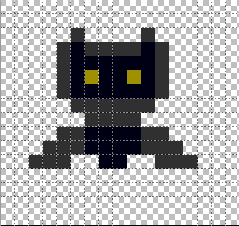

# BatPy
## Jogo educacional e acessível a deficientes visuais em pygame
 O jogo se baseia em um morcego tentando desviar de diversos obstáculos, para tornar o jogo ser acessível são utilizados sons para indicar os movimentos do jogador e se há obstáculos em seu caminho
<figure align="center" width="100%">
    
 <figcaption>Morcego protagonista de nosso jogo</figcaption>
</figure>
